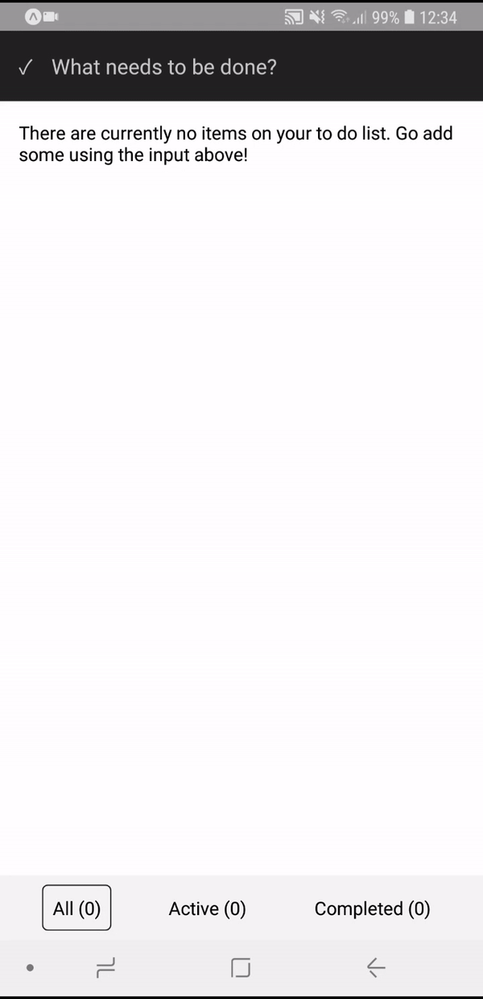

# react-native-todo-course
Learning React Native basics by coding a to do application (egghead course with my own twist). Learned about the following React Native components:

- Text
- View
- StyleSheet
- TextInput
- TouchableOpacity
- Alert
- ListView
- Keyboard
- Switch
- AsyncStorage
- ActivityIndicator

## Result

